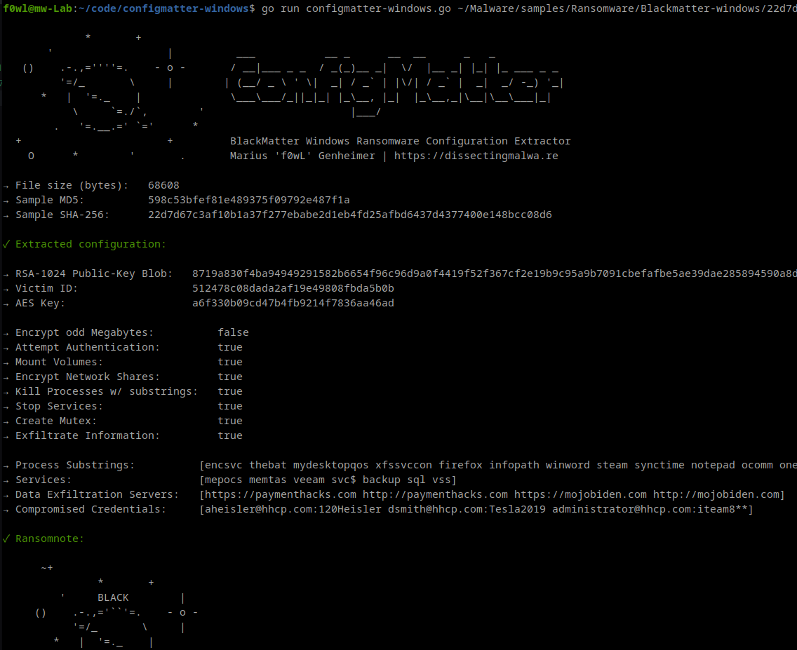
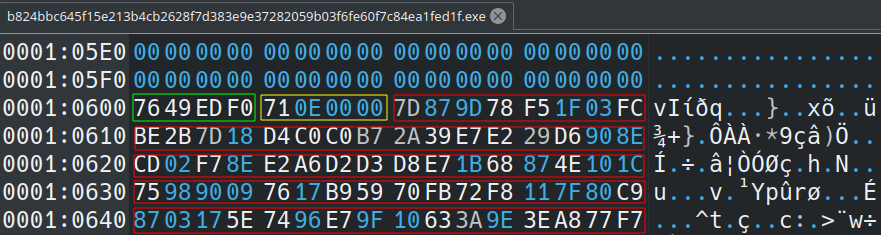
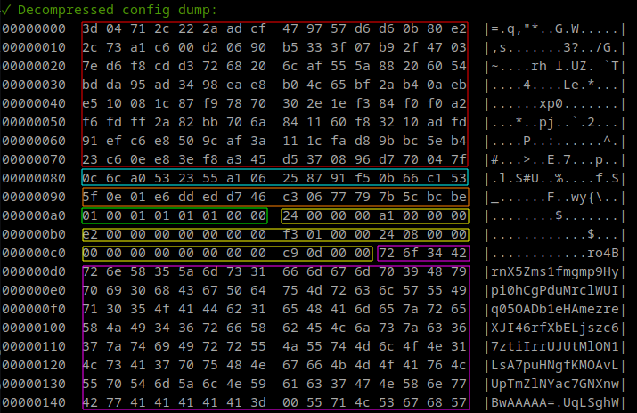
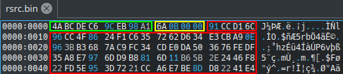

[](https://goreportcard.com/report/github.com/f0wl/configmatter-windows)

# configmatter-windows

ConfigMatter is a static configuration extractor implemented in Golang for BlackMatter Ransomware (targeting Microsoft Windows). By default the script will print the extracted information to stdout (using the ```-v``` (verbose) flag is recommended for deeper investigations (hexdump, debug information in case of errors). It is also capable of dumping the malware configuration to disk as a JSON file with the ```-j``` flag.

### Usage 

```shell
go run configmatter-windows.go [-v] [-version=1|2|3] [-j] path/to/sample.exe
```
### Screenshots



## Sources/Credits

Contrary to [Darkside-Config-Extract](https://github.com/advanced-threat-research/DarkSide-Config-Extract) developed by the McAfee Advanced Threat Research Team, which can handle both Darkside and BlackMatter samples, ConfigMatter can only extract BlackMatter configs. Since the Config Extractor by McAfee ATR is only available as a pre-compiled binary I decided to make my implementation public as well.

BlackMatter Ransomware and its configuration structure was covered in an [article](https://blog.group-ib.com/blackmatter) by Andrey Zhdanov for Group IB, which was quite helpful.

## Configuration structure

### Version 1.x

The first dword (green) contains the seed value for LCG pseudorandom number generator. The second dword (yellow) indicates the size of the following encrypted + aPLib compressed configuration (red).



To extract the configuration we first need to decrypt it (Link to the [Implementation](https://github.com/f0wl/configmatter-windows/blob/5f0922ee08a06937d43eb07d052c37ae298c2561/configmatter-windows.go#L118)). After that we can decompress the aPlib-compressed data. The result can be seen below: The first 80 bytes contain the RSA-1024 Public Key (red). After that we can find the victim ID (blue) and the AES Key (orange) used for encrypted information exfiltration. The following 8 bytes (green) define whether core capabilities of the ransomware are enabled or disbled. The dwords highlighted in yellow represent offsets for the configuration contents to aid parsing since some are optional. Lastly the configuration contains base64 encoded strings (pink) like for example process and service lists, exfiltration domains or the encrypted victim credentials and ransomnote.



### Version 2.x / 3.x

The first qword (green) contains the seed value for the PCG pseudorandom number generator (the major change in the configuration encryption since V1.x, Link to the [Implementation](https://github.com/f0wl/configmatter-windows/blob/5f0922ee08a06937d43eb07d052c37ae298c2561/configmatter-windows.go#L136)). The second dword (yellow) indicates the size of the following encrypted + aPLib compressed configuration (red).



There have been two minor changes to the configuration contents: a binary switch was introduced to enable or disable the ransomnote print on the default printer and an optional exclusion list for hashes of hostnames was introduced.

## Testing

This configuration extractor has been tested successfully with the following samples:

### Version 1.x

|                             SHA-256                              |                     Sample                              |
| :--------------------------------------------------------------: | :-----------------------------------------------------: |
| 22d7d67c3af10b1a37f277ebabe2d1eb4fd25afbd6437d4377400e148bcc08d6 | [Malshare](https://malshare.com/sample.php?action=detail&hash=22d7d67c3af10b1a37f277ebabe2d1eb4fd25afbd6437d4377400e148bcc08d6) |
| b824bbc645f15e213b4cb2628f7d383e9e37282059b03f6fe60f7c84ea1fed1f | [Malshare](https://malshare.com/sample.php?action=detail&hash=b824bbc645f15e213b4cb2628f7d383e9e37282059b03f6fe60f7c84ea1fed1f) |
| daed41395ba663bef2c52e3d1723ac46253a9008b582bb8d9da9cb0044991720 | [Malshare](https://malshare.com/sample.php?action=detail&hash=daed41395ba663bef2c52e3d1723ac46253a9008b582bb8d9da9cb0044991720) |
| 7f6dd0ca03f04b64024e86a72a6d7cfab6abccc2173b85896fc4b431990a5984 | [MalwareBazaar](https://bazaar.abuse.ch/sample/7f6dd0ca03f04b64024e86a72a6d7cfab6abccc2173b85896fc4b431990a5984) |


**Support for Version 2.x is WIP**

### Version 3.x

|                             SHA-256                              |                     Sample                              |
| :--------------------------------------------------------------: | :-----------------------------------------------------: |
| 9bae897c19f237c22b6bdc024df27455e739be24bed07ef0d409f2df87eeda58 | [MalwareBazaar](https://bazaar.abuse.ch/sample/9bae897c19f237c22b6bdc024df27455e739be24bed07ef0d409f2df87eeda58) |

If you encounter an error with ConfigMatter, please file a bug report via an issue. Contributions are always welcome :)
